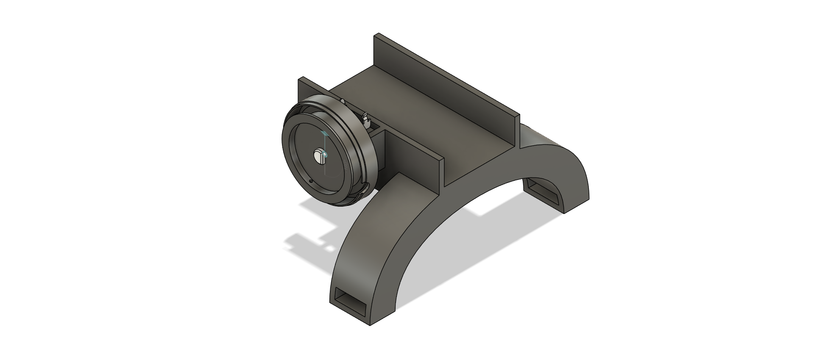

# Motion Tracked Hand

## Objective
The goal for this project was to be a proof of concept for a 3D hand and finger tracker. This would be accomplished via a gyroscope on the back of the hand and a string connecting the tip of each finger to a rotary encoder. This would allow for the extension of each finger to be tracked as well as the 3D position of the hand to be tracked as a whole. Ultimately this project should provide the base for a real-time hand tracker for VR or AR applications.

## I/O
#### Inputs:
* Gyroscope
* Push Button
* Encoder

#### Outputs:
* LCD display
* LED bar
* Status LEDs

## Design

## Software layout

#### Main Controller

#### LCD Controller

#### LED Bar Controller

## Future Work

Future work includes refining gyroscope data handling, implementing wireless communication between hand and rest of circuit, and further simplifying circuit if possible.